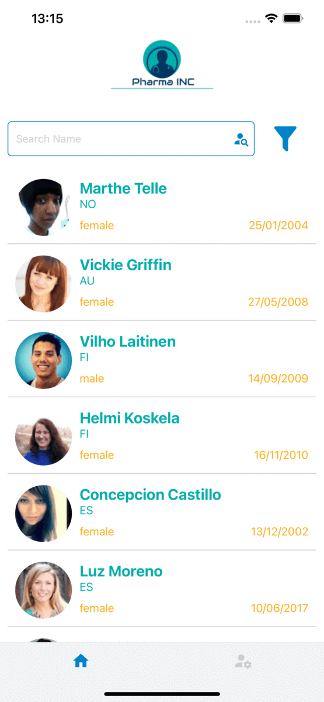

# Mobile Challenge 🏅 2021 by [Codesh](https://coodesh.com/)

## Descrição

Desenvolver uma tela de listagem de usuários utilizando a api [randomuser](https://randomuser.me/documentation).

 - Deve fitlrar por gênero, nacionalidade e um campo de busca.
 - Deve ter um loading more na lista.
 - Deve ter um modal mostrando os detalhes do usuário.

## Tecnologias

 - javascript
 - typescript
 - react native
 - redux toolkit
 - styled components

## Instalação

```sh
git clone https://github.com/lucianolopezz/codesh-challenge-react-native.git

cd codesh-challenge-react-native

yarn install

yarn ios ou yarn android
```

## Link do video
https://www.loom.com/share/726c2f9253244b5c9288d1b69552379c

## Preview

